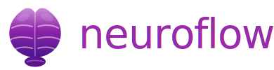

<div align="center">
  
  <h1>neuroflow</h1>
  <p><strong>The agentic operating system for neuroscience research.</strong></p>
  <p>
    <a href="#whats-new">What's new</a> ·
    <a href="#why-neuroflow">Why</a> ·
    <a href="#commands">Commands</a> ·
    <a href="#skills">Skills</a> ·
    <a href="#agents">Agents</a> ·
    <a href="#hooks">Hooks</a> ·
    <a href="#project-memory">Project memory</a> ·
    <a href="#installation">Install</a> ·
    <a href="#contributing">Contribute</a>
  </p>
</div>

---

## What's new in 0.2.12

- **Notes → flowie sync** ([`/notes`](commands/notes.md)) — after every notes session, Claude offers to copy the formatted note to `.neuroflow/flowie/notes/` for GitHub sync (default: yes); a local `config.json` stores per-project defaults for type, speaker, and project relation
- **Daily wellbeing tracking** ([`/flowie --assess`](commands/flowie.md)) — opt-in daily self-assessment for anxiety, energy, and happiness on a 1–10 scale (5=neutral); stored in `flowie/wellbeing/`; Claude prompts on any sync operation if today's entry is missing; enabled via `/flowie --init` or `/flowie --assess`

## What's new in 0.2.11

- **Removed broken `pubmed-mcp-server`** — replaced by `paper-search-mcp-nodejs` (the biorxiv server), which already includes `search_pubmed` and requires no credentials; `PUBMED_EMAIL` is no longer needed

## What's new in 0.2.10

- **Global device config** ([`/setup`](commands/setup.md)) — credentials can now be saved to `~/.neuroflow/integrations.json` (global, shared by all projects on the machine) instead of per-project; per-project still takes precedence and overrides global; Step 0 of the wizard asks which scope to use
- **Windows support in setup** — [`/setup`](commands/setup.md), [`neuroflow:setup`](skills/setup/SKILL.md), and the [e-INFRA reference](skills/setup/references/einfra-cc.md) now include Windows-specific paths and PowerShell env var syntax throughout
- **Proxy model-name fix** ([`proxy.mjs`](skills/setup/scripts/proxy.mjs)) — the proxy now restores the original `claude-*` model name in every response chunk, preventing Claude Code's *"unexpected model"* error when using custom LLM providers; [`flowie`](agents/flowie.md) now enforces that `integrations.json` is gitignored in the flowie sync repo

## What's new in 0.2.8

- **Session logging overhaul** — removed the noisy `[tool]` PostToolUse hook; Claude now owns all session logging and writes entries broadly (most actions, not just milestones); `neuroflow-core` logging rules are now marked MUST and non-negotiable
- **flow.md purity rule** — `flow.md` is now explicitly a pure index table; narrative content, figure maps, and cross-references must go in dedicated `.md` files in the phase subfolder
- **mind.js consistency check** — `sentinel-dev` Check 11 audits that every skill, command, and agent has a node in `docs/javascripts/mind.js`; missing `humanizer` node added; `neuroflow-develop` release workflow now flags this as a blocking step
- **[`scholar`](agents/scholar.md) sequential search + batch downloads** — searches now run PubMed → bioRxiv → fallbacks one at a time (was simultaneous); paper downloads processed in batches of 2 to reduce concurrency pressure and make failures easier to diagnose

## What's new in 0.2.6

- **Scholar agent: download reporting fixes** — `.pdf`/`.txt` files now correctly marked `⏭️ already downloaded`; `.md`-only stubs re-attempt download unless `reason: unavailable`; `✅ downloaded` is gated on a confirmed `.pdf` or `.txt` write; download summary counter now labelled `✅ [n] downloaded (PDF/text)` with a new `⏭️ [n] unavailable (metadata cached)` bucket
- **Scholar agent: search coverage fixes** — Semantic Scholar 429 rate-limit triggers a 3 s wait + retry then falls back to CrossRef/arXiv with a visible warning; PubMed query-overlap detection auto-generates 2–3 diversified queries when < 15 unique results or > 80% overlap; arXiv keyword fallback added when bioRxiv returns 0 results; mandatory coverage summary table printed before results, with any ⚠️/❌ row also surfaced as an inline warning block

## What's new in 0.2.5

- **[`/poster`](commands/poster.md)** — generate a LaTeX conference poster from project memory; five templates (A0/A1 portrait, A0 landscape, 90×120 cm, 48×36 in); QR code support via the `qrcode` package; iterative `poster-critic` review loop (up to 3 cycles) before the `.tex` file is saved
- **New [`poster-critic`](agents/poster-critic.md) agent** — audits every poster draft across five areas (content accuracy, visual balance, scientific communication, QR code, LaTeX correctness); returns `[STATUS: APPROVED]` or `[STATUS: REJECTED]` with specific, actionable feedback; never rewrites content
- **New [`neuroflow:phase-poster`](skills/phase-poster/SKILL.md) skill** — full LaTeX template catalogue with embedded QR code blocks, template selection guide, content extraction logic, and compilation instructions

## What's new in 0.2.4

- **Sentinel Check 3b** — sentinel now validates that `.claude-plugin/marketplace.json` version matches `plugin.json`; the marketplace version was silently stuck at `0.1.0` with no existing check to catch it
- **Hardened release checklist** — both [`neuroflow-developer.md`](.github/agents/neuroflow-developer.md) and [`neuroflow-develop/SKILL.md`](skills/neuroflow-develop/SKILL.md) now require `docs/changelog.md` entry, one-liner review, and `marketplace.json` bump on every release; `SKILL.md` synced to match `neuroflow-developer.md` (was missing `mkdocs.yml` and sentinel-dev steps)
- **Internal consistency fixes** — dead `neuroflow:scholar` skill ref in [`phase-paper`](skills/phase-paper/SKILL.md) corrected; [`/hive` docs page](docs/commands/hive.md) created; [`neuroflow-developer.md`](.github/agents/neuroflow-developer.md) and [`orchestrator`](agents/orchestrator.md) synced to full repo structure (22 phases, all 4 workflows, `scripts/automation/`)

## What's new in 0.2.3

- **PDF download resume and retry logic** — the `scholar` agent now checks which papers are already present in `.neuroflow/ideation/papers/` before downloading; interrupted runs are safely retried without duplicating work
- **Four-source fallback chain** — downloads now try Unpaywall → PubMed Central → bioRxiv direct → journal OA page in sequence; each source is attempted before moving to the next
- **Per-paper retry** — if all four sources fail, the agent waits 2 seconds and retries the full chain once more before marking a paper as unavailable
- **`⚠️ failed` vs `❌ unavailable` distinction** — transient network failures are now reported separately from confirmed no-OA-copy papers, with a named list of papers to retry and instructions to re-run the agent to resume
- **Removed `/paper-write` and `/paper-review`** — superseded by [`/paper`](commands/paper.md), which covers the full write→critique loop; nothing is lost
- **New [`/review`](commands/review.md) command** — for when YOU are the reviewer reading a colleague's paper; produces a structured referee report calibrated to the target journal by delegating to `neuroflow:review-neuro`
- **New [`review`](agents/review.md) agent and [`neuroflow:phase-review`](skills/phase-review/SKILL.md) skill** — autonomous peer reviewer agent and phase orientation skill for the referee workflow

## What's new in 0.2.2

- **Unified [`/paper`](commands/paper.md) command** — combines paper-write and paper-review into a single command and phase; every section draft goes through a brutal `paper-writer` → `paper-critic` loop (up to 3 iterations per section) before anything is saved; nothing reaches disk without critic approval or explicit user acceptance
- **New [`paper-writer`](agents/paper-writer.md) and [`paper-critic`](agents/paper-critic.md) agents** — the writer drafts section-by-section from upstream project memory; the critic applies the full six-area `neuroflow:review-neuro` methodology to every draft with zero tolerance for overclaims, statistical errors, or underreported methods
- **New [`neuroflow:phase-paper`](skills/phase-paper/SKILL.md) skill** — unified phase guidance covering journal recommendation, the write→critique loop protocol, critic standards, and output paths for the paper phase

## What's new in 0.2.1

- **ASCII welcome logo in [`/neuroflow`](commands/neuroflow.md)** — the main entry command now greets with a full ASCII logo for "neuroflow", the current version number, and the tagline *agentic neuroscience research, from hypothesis to publication*, followed by one of the three witty one-liners

## What's new in 0.2.0

- **Auto-issue consent gate** — `auto-issue` now checks `auto_issue_reporting:` in `project_config.md` before filing any issue; issues are only sent if the user explicitly opted in during project setup; missing or `no` value silently suppresses all automatic filing
- **Consent question in [`/neuroflow`](commands/neuroflow.md)** — project setup now asks whether the user allows anonymous issue reporting to the developers and saves the answer as `auto_issue_reporting: yes/no` in `project_config.md`
- **Cognitive probe embedded on home page** — simple static self-assessment block replaces the separate probe page

## What's new in 0.1.9

- **Worker-critic agentic loop** — new [`orchestrator`](agents/orchestrator.md) and [`critic`](agents/critic.md) agents coordinate up to 3 revision cycles for any phase output; the orchestrator routes to the correct phase worker, the critic returns `[STATUS: APPROVED]` or `[STATUS: REJECTED]` with specific actionable feedback, and the loop halts cleanly with a logged critique if approval is not reached
- **New [`neuroflow:worker-critic`](skills/worker-critic/SKILL.md) skill** — defines the full loop protocol, worker modes (Initial Draft / Revision), rubric construction, critic output format, and `critic-log.md` state tracking
- **Loop integrates with all 15 existing phase agents** — the orchestrator auto-selects the right worker for the active phase from `project_config.md`, covering 18 phases (preregistration, finance, and slideshow share workers with ideation, grant-proposal, and write-report respectively)

## What's new in 0.1.8

- **Target journal clarification in [`/neuroflow`](commands/neuroflow.md)** — on startup, if `paper-write` or `paper-review` is the active phase or in `recommended_phases` and no target journal is set, neuroflow asks whether the user wants a recommendation. If yes: searches PubMed and bioRxiv via the `scholar` agent, ranks 3–5 candidate journals by scope alignment, paper type, OA requirements, length, and prestige vs. speed, then writes the chosen journal to `project_config.md` (and `paper-write/flow.md` if it already exists).
- **Journal recommendation guidance in `neuroflow:phase-paper-write`** — new `## Journal recommendation` section: same search-and-rank workflow available when the skill is invoked directly via `/paper-write`, with explicit recency (past 3 years) and recurrence (≥3 of top 20 results) thresholds.
- **[`/flowie`](commands/flowie.md)** — personal research OS: link a private GitHub repository as a three-layer personal system — identity profile (stances, writing style, methodological preferences), a Kanban task board (`tasks/` with configurable columns, `--tasks --add/--move/--done/--archive`), and a project registry (`projects/` with ASCII phase timelines, `--projects --add`); supports `--init`, `--sync`, `--link`, `--view`, `--identify`, `--tasks`, and `--projects` modes; phase changes auto-sync to the project registry
- **[`neuroflow:phase-flowie`](skills/phase-flowie/SKILL.md)** — phase skill covering how to read and apply the flowie profile in every other phase, write rules for `.neuroflow/flowie/`, and a privacy-conscious GitHub sync protocol (always pull before push, diffs before applying, conflicts shown side by side)
- **[`flowie` agent](agents/flowie.md)** — autonomous personalization agent that reads the user's profile at session start, surfaces active tasks for the current project, and shapes all assistance to their documented intellectual fingerprint; never exposes profile data in external-facing outputs
- **New fixed quote** — added *"I will jump to version 1.0.0 once I manage to publish the first paper"* to the [homepage quote bubbles](https://stanislavjiricek.github.io/neuroflow/)
- **Two new fixed quotes added to the homepage hero** — "We will probably be the first ones to understand the brain." and "When I said we, I meant you as well, are you in?" appended as adjacent entries in the [`overrides/main.html`](overrides/main.html) quotes rotation
- **[`/output`](commands/output.md)** — renamed from `/export` to avoid conflict with Claude's built-in `/export` command (which exports conversations); functionality is identical; skill renamed to [`neuroflow:phase-output`](skills/phase-output/SKILL.md)
- **New quote** — added "Can you collect some brain data for me?" to the homepage quote carousel in [`overrides/main.html`](overrides/main.html)
- **[Cognitive Development Probe](docs/probe.html)** — a self-contained interactive diagnostic: 7 neuroscience-inspired yes/no questions (prediction error, model update, uncertainty, decision monitoring, self-model, global integration, subjective experience); Q7 locked until Q1–Q6 are all YES; color-coded status indicators, "Cognitive Level" progress bar, reset button; includes a read-only **Claude's honest self-assessment** section where the model answers each question as of this version — no hedging, no performance
- **[`/grant-proposal`](commands/grant-proposal.md) dramatically improved** — auto-discovers ideation outputs, fetches funder calls from URLs, supports NIH/ERC/Wellcome/MRC/GAČR/DFG/Horizon Europe with built-in review criteria, and drafts section by section with word-count tracking and quality checklists
- **[`grant-proposal` agent](agents/grant-proposal.md) upgraded** — autonomous funder call parsing, neuroscience-aware Approach drafting (EEG/fMRI/iEEG/eye-tracking), and per-section confirmation loop
- **[`phase-grant-proposal` skill](skills/phase-grant-proposal/SKILL.md) expanded** — deep funder knowledge base, review criteria alignment table, common fatal weaknesses guide, and neuroscience-specific power analysis and preprocessing standards

## What's new in 0.1.7

- **[`neuroflow-developer`](.github/agents/neuroflow-developer.md)** — superspecialized GitHub agent for developing and maintaining the neuroflow plugin; merges `neuroflow-core` lifecycle rules and `neuroflow-develop` guidance into one repo-aware agent; reads the live state of every skill, command, agent, and hook at the start of each session so it is always operating on what the repo actually contains

## What's new in 0.1.6

- **[Neuroflow Mind](https://stanislavjiricek.github.io/neuroflow/mind/)** — interactive mind map visualization of the entire neuroflow universe; every command, skill, agent, and concept rendered as a force-directed graph with phase clustering; click any node to explore its connections and open its docs; colored receptor dots on each node surface reveal its domain tags (EEG, fMRI, brain-sim, stats, ML, writing, literature, memory, code, human); accessible from the homepage hero button
- **Visual phase map in [`/phase`](commands/phase.md)** — the phase command now renders a full phase map with four distinct markers: `●` current phase, `◉` visited (`.neuroflow/{phase}/` subfolder exists), `→` recommended by neuroflow after the interview, `○` not started; phases are grouped so active and visited appear first, followed by recommended, then the rest
- **Phase sequence suggestion in [`/neuroflow`](commands/neuroflow.md)** — after the initial interview (new Step 2b), neuroflow now derives and prints a recommended ordered phase sequence tailored to the project, and saves it as `recommended_phases` in `project_config.md`; `/phase` reads this field to render the `→` markers in the phase map
- **Phase outlook in [`/interview`](commands/interview.md)** — at the end of any interview session, neuroflow suggests which neuroflow phases are most relevant to where the user is heading, based on the session content and the existing project config

## What's new in 0.1.5

- **[`/git`](commands/git.md)** — context-aware git utility with smart shorthand aliases (`p`, `pl`, `ps`, `a`, `c`, `ac`, `acp`, `b`, `pr`); reads repo state to decide push vs pull, suggests commit messages, and can open PRs via `gh` CLI
- **[`/output`](commands/output.md)** — new utility command and [`neuroflow:phase-output`](skills/phase-output/SKILL.md) skill: export project memory or the whole project as a zip archive or folder copy; always excludes sessions and credentials; logs each export run to `.neuroflow/output/`
- **Slash command availability in all skills** — when any phase skill is invoked directly without its slash command, it now runs the full workflow and mentions the corresponding `/neuroflow:<command>` at the end; behavior defined in [`neuroflow:neuroflow-core`](skills/neuroflow-core/SKILL.md) and declared in each phase skill's `## Slash command` section
- **[`neuroflow:neuroflow-core`](skills/neuroflow-core/SKILL.md)** — added **Default agent behavior** section: scientific honesty (no sugar-coating), dry English humor, and conservative-by-default mode (follow neuroflow-core; only add new functionality when explicitly asked)
- **[`/neuroflow`](commands/neuroflow.md) greeting** — on start, neuroflow now greets with `Hi, neuroflow here (v0.1.5)` followed by a randomly chosen line (*let's do some magic today*, *let's go hack some stuff*, or *I heard HARKing is fun*)
- **15 phase agents** — [`ideation`](agents/ideation.md), [`grant-proposal`](agents/grant-proposal.md), [`experiment`](agents/experiment.md), [`tool-build`](agents/tool-build.md), [`tool-validate`](agents/tool-validate.md), [`data`](agents/data.md), [`data-preprocess`](agents/data-preprocess.md), [`data-analyze`](agents/data-analyze.md), [`notes`](agents/notes.md), [`write-report`](agents/write-report.md), [`brain-build`](agents/brain-build.md), [`brain-optimize`](agents/brain-optimize.md), [`brain-run`](agents/brain-run.md) — each agent is a specialist autonomous subprocess scoped to its phase, with a plan-first / confirm-before-executing discipline
- **[`/preregistration`](commands/preregistration.md)** — new command and [`neuroflow:phase-preregistration`](skills/phase-preregistration/SKILL.md) skill: draft OSF, AsPredicted, or registered-report pre-registrations; review for completeness; log deviations; link registered reports
- **[`/finance`](commands/finance.md)** — new command and [`neuroflow:phase-finance`](skills/phase-finance/SKILL.md) skill: budget planning, expense logging, funder-facing financial reports, and grant compliance checks
- **[`/pipeline`](commands/pipeline.md)** — define and run a multi-step research pipeline across any sequence of neuroflow phases; interactive by default (pauses for approval between steps), or pass `--executor` for brutal mode (runs straight through without stops); supports resuming from a saved plan and graceful error handling
- **Behavioral flags** — three prompt-level personality modes added to [`neuroflow:neuroflow-core`](skills/neuroflow-core/SKILL.md): `executor` (aggressive evaluation loop — reruns and self-critiques until high-quality threshold is met), `teacher` (clarify-first mode — asks targeted questions before each step, proceeds incrementally), and `critic` (interrogates assumptions, surfaces hard questions first). Include any mode keyword in a prompt and it activates for the full command session.

## What's new in 0.1.4

- **[`/quiz`](commands/quiz.md)** — neuroscience quiz command with three modes: flashcards (saveable A4 printable layout), pub quiz (with neuroscience-themed house rules), and rapid-fire throw questions (default)
- **[`/fails`](commands/fails.md)** — new utility command and [`neuroflow:phase-fails`](skills/phase-fails/SKILL.md) skill: log dissatisfaction (core behavior, science quality, or interaction UX) to `.neuroflow/fails/`, with optional one-click GitHub issue reporting
- **[`/idk`](commands/idk.md)** — a small easter egg: a personal support companion for when you're burned out, overwhelmed by deadlines, or just need to think out loud; breaks down impossible task lists and lets you decompress mid-research
- **[`/interview`](commands/interview.md)** — interview preparation from either side of the table; generates tailored questions grounded in your research context, runs practice Q&A, and optionally evaluates your readiness
- **Brain simulation commands** — [`/brain-build`](commands/brain-build.md), [`/brain-optimize`](commands/brain-optimize.md), and [`/brain-run`](commands/brain-run.md) for assembling, fitting, and running computational brain models (NEURON, Brian2, NetPyNE, NEST, tvb-library)

## What's new in 0.1.3

- **`/start` renamed to [`/neuroflow`](commands/neuroflow.md)** — the main entry point is now `/neuroflow:neuroflow`; all commands, docs, and agents updated
- **Behavioral improvements** — lifecycle hardened based on real-session feedback: continuous session logging, live [`flow.md`](skills/neuroflow-core/SKILL.md) updates, phase transition prompts, utility scripts routed to `.neuroflow/{phase}/tools/`, local `.claude/CLAUDE.md` creation enforced in project root

## What's new in 0.1.2

- 12 phase skills — [`neuroflow:phase-ideation`](skills/phase-ideation/SKILL.md) through [`neuroflow:phase-write-report`](skills/phase-write-report/SKILL.md) — each loaded automatically by its corresponding command to orient agent approach, relevant skills, and workflow hints

## What's new in 0.1.1

- Full research pipeline — commands from [`/neuroflow`](commands/neuroflow.md) through `/paper` and `/review`, each writing to `.neuroflow/` project memory
- [`neuroflow:neuroflow-core`](skills/neuroflow-core/SKILL.md) — shared lifecycle and `.neuroflow/` folder spec that every command and agent follows; commands now automatically append significant decisions to `.neuroflow/reasoning/{phase}.json`
- [`scholar`](agents/scholar.md), [`sentinel`](agents/sentinel.md), [`sentinel-dev`](agents/sentinel-dev.md) agents
- `sentinel` checks plugin version against `project_config.md` and flags when the plugin has been updated; both sentinels clear their report to "All clear" after fixing issues
- `project_config.md` now tracks `plugin_version` — kept in sync with `plugin.json` by `/neuroflow` and `/sentinel`
- MCP servers declared in `plugin.json`: PubMed, bioRxiv, Miro, Context7

---

## Why neuroflow

Most neuroscience software solves one problem at a time — a preprocessing library, a stats package, a reference manager. You still have to stitch everything together yourself, re-explain context at every step, and manually translate between tools and phases.

neuroflow is different. It is not a toolbox. It is the **agentic operating system for neuroscience research** — orchestrating every phase from the first hypothesis all the way to a manuscript draft.

You work in your editor. Claude works alongside you — reading your data, writing analysis code, reviewing your paper, auditing your statistics — guided by skills and agents that understand neuroscience domain conventions.

**Focused on:**

- EEG, iEEG, fMRI, eye tracking, ECG, and other physiological signals
- Cognitive, clinical, and preclinical research
- Experimental paradigm development and real-time systems
- From hypothesis formulation to paper draft

---

## Commands

Run `/neuroflow:<command>` in any project folder. Start with `/neuroflow:neuroflow`.

### Entry point

| Command | What it does |
|---|---|
| [`/neuroflow`](commands/neuroflow.md) | Main entry point — if `.neuroflow/` exists, shows current phase and status; if not, interviews the user and creates the project memory structure |
| [`/setup`](commands/setup.md) | Interactive credential wizard — configure PubMed email, Miro access token, and Google Workspace CLI; saves to `.neuroflow/integrations.json` |

### Research pipeline

| Command | What it does |
|---|---|
| [`/ideation`](commands/ideation.md) | Brainstorm a research question, explore literature via scholar, formalize an idea, or produce a project proposal |
| [`/preregistration`](commands/preregistration.md) | Pre-register study design and analysis plan on OSF or AsPredicted; review for completeness; log deviations; link registered reports |
| [`/grant-proposal`](commands/grant-proposal.md) | Write a grant application — specific aims, significance, innovation, approach, budget, timeline |
| [`/finance`](commands/finance.md) | Manage the project budget, log expenses, produce financial reports, and check grant compliance |
| [`/experiment`](commands/experiment.md) | Paradigm design (PsychoPy), recording setup, instrument and LSL configuration |
| [`/tool-build`](commands/tool-build.md) | Build a lab tool or software pipeline — real-time systems, acquisition, BCI, paradigm code |
| [`/tool-validate`](commands/tool-validate.md) | Create a testing pipeline to verify a tool or paradigm works correctly |
| [`/data`](commands/data.md) | Data intake — locate data, validate BIDS structure, run conversion scripts |
| [`/data-preprocess`](commands/data-preprocess.md) | Run a preprocessing pipeline — filtering, ICA, epoching, artifact rejection, QC |
| [`/data-analyze`](commands/data-analyze.md) | Run an analysis pipeline — ERPs, time-frequency, connectivity, decoding, GLM |
| [`/paper`](commands/paper.md) | Unified manuscript writing and review — draft section by section, brutal write→critique loop, nothing saved without approval |
| [`/review`](commands/review.md) | Peer review a colleague's paper — structured referee report calibrated to the target journal |
| [`/notes`](commands/notes.md) | Live note-taking — capture freeform input, then reformat into a clean structured document |
| [`/write-report`](commands/write-report.md) | Generate a structured report from `.neuroflow/` contents for any phase or the whole project |

### Brain simulation

| Command | What it does |
|---|---|
| [`/brain-build`](commands/brain-build.md) | Assemble a computational brain model — neuron models, network topology, connectivity, simulation framework setup |
| [`/brain-optimize`](commands/brain-optimize.md) | Run a parameter search or fit the model to experimental data |
| [`/brain-run`](commands/brain-run.md) | Run the model as a simulation — configure run parameters, launch, and collect outputs |

### Utility

| Command | What it does |
|---|---|
| [`/git`](commands/git.md) | Context-aware git utility — smart push/pull, commit message generation, branch management, and PR creation with shorthand aliases |
| [`/pipeline`](commands/pipeline.md) | Define and run a multi-step research pipeline — interactive by default (pauses for approval between steps), or use `--executor` for brutal mode (runs straight through without stops) |
| [`/interview`](commands/interview.md) | Interview preparation from either side — generate tailored questions grounded in your research context, run practice Q&A, and optionally evaluate readiness |
| [`/phase`](commands/phase.md) | Show current phase and all phases worked on; optionally switch phase |
| [`/sentinel`](commands/sentinel.md) | Full audit of `.neuroflow/` — drift detection, broken references, preregistration vs progress |
| [`/slideshow`](commands/slideshow.md) | Build a presentation from selected areas of the project — pick phases, figures, and key findings, then get a structured slide deck ready to export |
| [`/poster`](commands/poster.md) | Generate a LaTeX conference poster from project memory — choose template size, add a QR code, and get an iteratively reviewed `.tex` file ready to compile |
| [`/quiz`](commands/quiz.md) | Neuroscience quiz — flashcards, pub quiz, or rapid-fire throw questions; covers any subfield or general neuroscience |
| [`/fails`](commands/fails.md) | Log dissatisfaction — record core behavior, science quality, or UX issues; optionally opens a GitHub issue report |
| [`/output`](commands/output.md) | Output project memory or the whole project — pack as a zip archive or copy to a folder for sharing, archiving, or handoff |
| [`/idk`](commands/idk.md) | Personal support companion — decompress, break down overwhelming tasks, or just chat |
| [`/search`](commands/search.md) | Lightweight scoped search — use `memory:` to search `.neuroflow/` or `project:` to search the codebase; uses `flow.md` as a fast index |
| [`/flowie`](commands/flowie.md) | Personal research OS — link a private GitHub repository as identity profile + Kanban task board + project registry with phase tracking; Claude reads the profile to personalize assistance and surfaces active tasks at session start |
| [`/hive`](commands/hive.md) | Team knowledge layer — connect your project to a shared GitHub org repo to sync team research directions, share findings explicitly, and get team-aware recommendations |

---

## Skills

Skills are invoked by Claude automatically when relevant, or triggered explicitly.

| Skill | What it does |
|---|---|
| [`neuroflow:neuroflow-core`](skills/neuroflow-core/SKILL.md) | Core rules and lifecycle for all commands and agents — `.neuroflow/` folder spec, `flow.md` format, command lifecycle (including auto-write to `reasoning/{phase}.json`), frontmatter standard, and behavioral flags (`teacher`, `executor`, `critic`) |
| [`neuroflow:review-neuro`](skills/review-neuro/SKILL.md) | Rigorous pre-submission peer review of a neuroscience manuscript |
| [`neuroflow:worker-critic`](skills/worker-critic/SKILL.md) | Worker-critic agentic loop protocol — orchestrator coordinates a worker agent and a critic agent across up to 3 revision cycles to produce a vetted output for any phase |
| [`neuroflow:neuroflow-develop`](skills/neuroflow-develop/SKILL.md) | Guide for developing and maintaining the neuroflow plugin |
| [`neuroflow:skill-creator`](skills/skill-creator/SKILL.md) | Guide for creating new neuroflow skills |
| [`neuroflow:setup`](skills/setup/SKILL.md) | Configure integrations — PubMed, Miro, Google Workspace, and custom LLM providers (including e-INFRA CZ for Czech researchers). |
| [`neuroflow:phase-git`](skills/phase-git/SKILL.md) | Phase guidance for /git — context-aware git shorthand rules, smart push/pull logic, commit message generation, branch management, and PR creation |
| [`neuroflow:phase-ideation`](skills/phase-ideation/SKILL.md) | Phase guidance for /ideation — approach, relevant skills, workflow hints |
| [`neuroflow:phase-preregistration`](skills/phase-preregistration/SKILL.md) | Phase guidance for /preregistration — registry templates, completeness checks, deviation logging |
| [`neuroflow:phase-grant-proposal`](skills/phase-grant-proposal/SKILL.md) | Phase guidance for /grant-proposal |
| [`neuroflow:phase-finance`](skills/phase-finance/SKILL.md) | Phase guidance for /finance — budget planning, expense tracking, compliance checks |
| [`neuroflow:phase-experiment`](skills/phase-experiment/SKILL.md) | Phase guidance for /experiment |
| [`neuroflow:phase-tool-build`](skills/phase-tool-build/SKILL.md) | Phase guidance for /tool-build |
| [`neuroflow:phase-tool-validate`](skills/phase-tool-validate/SKILL.md) | Phase guidance for /tool-validate |
| [`neuroflow:phase-data`](skills/phase-data/SKILL.md) | Phase guidance for /data |
| [`neuroflow:phase-data-preprocess`](skills/phase-data-preprocess/SKILL.md) | Phase guidance for /data-preprocess |
| [`neuroflow:phase-data-analyze`](skills/phase-data-analyze/SKILL.md) | Phase guidance for /data-analyze |
| [`neuroflow:phase-paper`](skills/phase-paper/SKILL.md) | Phase guidance for /paper — unified write→critique loop, journal recommendation, critic standards |
| [`neuroflow:phase-review`](skills/phase-review/SKILL.md) | Phase guidance for /review — referee orientation, delegation to review-neuro, output to .neuroflow/review/ |
| [`neuroflow:humanizer`](skills/humanizer/SKILL.md) | Strip AI writing signatures from prose — word blacklist, rhythm fixes, register calibration; replaces stop-slop |
| [`neuroflow:phase-notes`](skills/phase-notes/SKILL.md) | Phase guidance for /notes |
| [`neuroflow:phase-write-report`](skills/phase-write-report/SKILL.md) | Phase guidance for /write-report |
| [`neuroflow:phase-quiz`](skills/phase-quiz/SKILL.md) | Phase guidance for /quiz — mode behaviour, question quality standards, mode-specific workflow |
| [`neuroflow:phase-fails`](skills/phase-fails/SKILL.md) | Phase guidance for /fails — categorisation approach, GitHub reporting, and dissatisfaction capture rules |
| [`neuroflow:phase-output`](skills/phase-output/SKILL.md) | Phase guidance for /output — scope selection, safe exclusions, file naming, and output format guidance |
| [`neuroflow:phase-brain-build`](skills/phase-brain-build/SKILL.md) | Phase guidance for /brain-build — neuron models, connectivity, simulation framework |
| [`neuroflow:phase-brain-optimize`](skills/phase-brain-optimize/SKILL.md) | Phase guidance for /brain-optimize — parameter sweeps, data fitting, optimisation algorithms |
| [`neuroflow:phase-brain-run`](skills/phase-brain-run/SKILL.md) | Phase guidance for /brain-run — run configuration, simulation launch, output sanity checks |
| [`neuroflow:phase-search`](skills/phase-search/SKILL.md) | Phase guidance for /search — tag-based scoping, flow.md-first indexing strategy, compact summary format |
| [`neuroflow:phase-pipeline`](skills/phase-pipeline/SKILL.md) | Phase guidance for /pipeline — interactive vs brutal mode behaviour, pipeline plan format, resume logic, error handling |
| [`neuroflow:phase-flowie`](skills/phase-flowie/SKILL.md) | Phase guidance for /flowie — profile read and apply rules, write rules for `.neuroflow/flowie/`, GitHub sync protocol, cross-phase personalization |
| [`neuroflow:phase-poster`](skills/phase-poster/SKILL.md) | LaTeX poster generation — five templates (A0/A1/A2, portrait/landscape, US size), QR code integration, template selection guide, content extraction logic |
| [`neuroflow:notebooklm`](skills/notebooklm/SKILL.md) | Complete API for Google NotebookLM — create notebooks, add sources, generate all artifact types (podcast, video, slide deck, infographic, report, quiz, flashcards, mind map), and download results in multiple formats |
| [`neuroflow:phase-hive`](skills/phase-hive/SKILL.md) | Team-level knowledge layer — connects a researcher's project to a shared GitHub org repo where team directions, cross-project findings, and recommended methods are coordinated; all sharing is explicit |
| [`neuroflow:phase-slideshow`](skills/phase-slideshow/SKILL.md) | Phase guidance for /slideshow — audience calibration, slide count heuristics, Markdown/reveal.js and structured outline output formats |
| [`neuroflow:pupil-labs-neon-realtime`](skills/pupil-labs-neon-realtime/SKILL.md) | Connect to Pupil Labs Neon eye-tracking glasses and collect real-time data streams (video, gaze, IMU, events) via the Real-time API |

---

## Agents

Agents are autonomous subprocesses launched by commands when deeper, focused work is needed.

| Agent | What it does |
|---|---|
| [`scholar`](agents/scholar.md) | Searches PubMed → bioRxiv → fallbacks sequentially, returns a clean paper list with ⚠️ preprint and 🔒 paywall markers, downloads in batches of 2; supports follow-up synthesis and saving |
| [`sentinel`](agents/sentinel.md) | Project coherence guard — audits `.neuroflow/` for drift, broken references, preregistration deviations, and plugin version sync; clears report after fixes |
| [`sentinel-dev`](agents/sentinel-dev.md) | Plugin development coherence guard — checks folder names vs frontmatter, README tables, version sync, dead references, command frontmatter completeness |
| [`critic`](agents/critic.md) | Critic agent — audits worker drafts against a provided rubric; returns `[STATUS: APPROVED]` or `[STATUS: REJECTED]` with specific, actionable feedback; used by the orchestrator in the worker-critic loop |
| [`orchestrator`](agents/orchestrator.md) | Orchestrator agent — manages the worker-critic loop for any phase; decomposes the task, routes to the appropriate phase worker agent, submits output to the critic, tracks iterations, and delivers the final vetted result |
| [`ideation`](agents/ideation.md) | Ideation phase specialist — crystallises research questions via brainstorm, literature explore (via scholar), formalise, or proposal modes |
| [`grant-proposal`](agents/grant-proposal.md) | Grant writing specialist — structures proposals section by section for a target funder (NIH, ERC, Wellcome, MRC); confirms limits before drafting |
| [`experiment`](agents/experiment.md) | Experiment design specialist — paradigm design (PsychoPy), recording setup, and instrument configuration for EEG, fMRI, eye-tracking, ECG |
| [`tool-build`](agents/tool-build.md) | Lab tool builder — spec-first design and implementation of acquisition, real-time, LSL, BCI, and analysis pipeline tools |
| [`tool-validate`](agents/tool-validate.md) | Tool validation specialist — timing, marker integrity, output format, and edge-case testing; writes validation-plan.md before running any tests |
| [`data`](agents/data.md) | Data intake specialist — inventory → BIDS validation → conversion sequence; confirms modality before touching anything |
| [`data-preprocess`](agents/data-preprocess.md) | Preprocessing specialist — modality-aware pipeline (EEG, fMRI, ECG, eye-tracking); documents all parameters before running |
| [`data-analyze`](agents/data-analyze.md) | Statistical analysis specialist — ERPs, time-frequency, connectivity, decoding, GLM; audits assumptions and applies multiple-comparison correction |
| [`paper-writer`](agents/paper-writer.md) | Unified paper phase writer — drafts sections from upstream memory inside the brutal write→critique loop; revises against every critic bullet |
| [`paper-critic`](agents/paper-critic.md) | Unified paper phase critic — applies full six-area review-neuro methodology to every draft; returns [STATUS: APPROVED] or [STATUS: REJECTED] with specific actionable feedback |
| [`review`](agents/review.md) | Peer reviewer agent — reads a colleague's paper and produces a structured referee report calibrated to the target journal; delegates to review-neuro |
| [`notes`](agents/notes.md) | Live note-taking specialist — captures freeform input without interruption; reformats into a structured document only when asked |
| [`write-report`](agents/write-report.md) | Report generation specialist — synthesises `.neuroflow/` memory into a structured report for any phase or the full project |
| [`brain-build`](agents/brain-build.md) | Computational brain model builder — spec-first design of neuron models and network topology for NEURON, Brian2, NetPyNE, NEST, tvb-library |
| [`brain-optimize`](agents/brain-optimize.md) | Parameter optimisation specialist — plans sweeps or data-fitting runs; selects the right algorithm (grid, differential evolution, Bayesian, BluePyOpt) |
| [`brain-run`](agents/brain-run.md) | Simulation runner — configures and executes runs, sanity-checks outputs for silence, runaway activity, or NaN values; supports HPC job submission |
| [`neuroflow-developer`](.github/agents/neuroflow-developer.md) | Superspecialized plugin development agent — merges neuroflow-core and neuroflow-develop into one repo-aware agent; reads live repo state at session start; handles skills, commands, agents, hooks, docs, and releases |
| [`poster-critic`](agents/poster-critic.md) | Conference poster critic — audits every LaTeX poster draft across five areas (content, layout, scientific communication, QR code, LaTeX correctness); returns APPROVED or REJECTED with actionable feedback; operates inside the /poster worker-critic loop |
| [`flowie`](agents/flowie.md) | Personal identity agent — reads the user's flowie profile, surfaces active tasks for the current project at session start, and applies research stances, writing style, and methodological preferences throughout the session; never exposes profile data in external-facing outputs |
| [`literature-review`](agents/literature-review.md) | Literature review specialist — runs 12 sequential analytical lenses on a set of downloaded papers (landscape mapping through future research agenda) using the worker-critic loop to ensure rigour |

---

## Hooks

Hooks fire automatically on tool use events.

| Hook | Trigger | What it does |
|---|---|---|
| ruff formatter | `PostToolUse` — Edit / Write | Auto-formats any `.py` file written during a session |
| flowie git-sync | `PostToolUse` — Edit / Write | Auto-commits and pushes any write to `.neuroflow/flowie/` to the linked private GitHub repo |

> **Pre-session orientation** is handled via `.claude/CLAUDE.md` injection — `/neuroflow` writes a neuroflow block there so Claude always knows the active phase and where to find project context.

---

## Project memory

Every neuroflow command writes its output to `.neuroflow/` at the root of your project repo. This is the shared memory of your project — readable by every command and agent, across sessions.

```
.neuroflow/
├── project_config.md       ← current phase, research question, tools, plugin_version — read by every command
├── flow.md                 ← index of all subfolders
├── sentinel.md             ← sentinel audit report
├── linked_flows.md         ← paths to other .neuroflow/ folders (optional)
├── team.md                 ← project members and roles (optional)
├── timeline.md             ← milestones and deadlines (optional)
├── sessions/               ← one .md per day — add to .gitignore
├── reasoning/              ← structured per-phase decision logs (JSON: statement, source, reasoning)
├── ethics/                 ← IRB documents, consent forms
├── preregistration/        ← OSF / AsPredicted documents
├── finance/                ← grant documents, expense tracking
├── ideation/               ← research questions, proposals, literature reviews
├── grant-proposal/         ← grant application drafts
├── experiment/             ← paradigm scripts, recording setup docs
├── tool-build/             ← tool specs and build notes
├── tool-validate/          ← validation plans and results
├── data/                   ← data inventory and intake reports
├── data-preprocess/        ← preprocessing configs and QC reports
├── data-analyze/           ← analysis plans and result summaries
├── paper/                  ← manuscript drafts and critic logs
├── notes/                  ← structured notes from meetings and talks
└── write-report/           ← project reports
└── fails/                  ← dissatisfaction log: core.md, science.md, ux.md
└── output/                 ← output log: one .md per export run
```

---

## Installation

**Claude Code:**

```bash
claude plugin marketplace add stanislavjiricek/neuroflow
claude plugin install neuroflow@neuroflow
```

Or from within Claude Code:

```
/plugin marketplace add stanislavjiricek/neuroflow
/plugin install neuroflow@neuroflow
```

**GitHub Copilot CLI:**

```bash
copilot plugin install stanislavjiricek/neuroflow
```

Or from within an interactive Copilot session:

```
/plugin install stanislavjiricek/neuroflow
```

For local development (Claude Code):

```bash
git clone https://github.com/stanislavjiricek/neuroflow
claude --plugin-dir ./neuroflow
```

Once installed, run `/neuroflow:neuroflow` in any project folder to get started.

---

## MCP server credentials

neuroflow uses four MCP servers that are launched automatically via `npx`. One requires credentials:

| Server | Package | Credentials needed |
|---|---|---|
| PubMed / bioRxiv | `paper-search-mcp-nodejs` | none |
| Miro | `@k-jarzyna/mcp-miro` | `MIRO_ACCESS_TOKEN` — personal access token from Miro |
| Context7 | `@upstash/context7-mcp` | none |

neuroflow also supports an optional **Google Workspace CLI** (`gws`) for Gmail, Calendar, Drive, Sheets, and more. It is separate from the MCP servers and must be installed manually:

| Tool | Install | Credentials needed |
|---|---|---|
| Google Workspace CLI | `npm install -g @googleworkspace/cli` (requires Node.js 18+) | OAuth client_secret.json from Google Cloud Console → `GOOGLE_WORKSPACE_CLI_CREDENTIALS_FILE` |

> **Note:** `gws auth setup` requires the `gcloud` CLI. If `gcloud` is not installed, use the manual OAuth path: create credentials in [Google Cloud Console](https://console.cloud.google.com), download `client_secret.json`, place it at `~/.config/gws/client_secret.json`, and run `gws auth login`.

### Setup wizard

Run `/neuroflow:setup` (or answer **Y** when prompted during `/neuroflow:neuroflow`) to enter a guided wizard:

1. **Miro** — paste a personal access token from your [Miro developer settings](https://miro.com/app/settings/user-profile/apps). Skippable.
2. **Google Workspace CLI** — checks if `gws` is installed; offers to install via npm if not; guides through the manual OAuth credential path (no `gcloud` required). Skippable.

Credentials are saved to **`.neuroflow/integrations.json`** in your project folder. This file is excluded from git (see `.gitignore`) so it is never committed.

### Activating credentials

After running `/setup`, export the env vars in your shell before starting Claude Code:

```bash
export MIRO_ACCESS_TOKEN="eyJ..."
export GOOGLE_WORKSPACE_CLI_CREDENTIALS_FILE="$HOME/.config/gws/client_secret.json"
```

Add these to your shell profile (`~/.zshrc`, `~/.bashrc`) so they load automatically on every session.

Alternatively, you can set the env vars directly without running the wizard — the plugin will use whichever values are present in the environment.

### What is automatic vs manual

| Step | Automatic | Manual |
|---|---|---|
| MCP server processes started | ✅ Launched automatically via `npx` | — |
| Miro token entry | ✅ Prompted by `/setup` wizard | ⚠️ You must create the token in the Miro browser UI first |
| Miro OAuth browser login | ❌ Not implemented (by design — browser OAuth from a terminal subprocess is not feasible without a redirect server) | Use a personal access token instead |
| Google Workspace CLI install | ✅ `/setup` wizard can run `npm install -g` if you confirm | Requires Node.js 18+ |
| Google Workspace OAuth | ❌ `gws auth setup` requires `gcloud` CLI | Manual path: download `client_secret.json` from GCP Console, run `gws auth login` |
| Env var export | ❌ Not automatic | Run `export …` or add to shell profile |

### Reminder behavior

- If you mention Miro during ideation and `MIRO_ACCESS_TOKEN` is missing, a reminder to run `/neuroflow:setup` appears.
- You can always re-run `/neuroflow:setup` to add or update credentials.

---

## Contributing

neuroflow is intentionally small right now — and that's the point. It is designed to grow with the community.

If you work in neuroscience and have a workflow that Claude could help with, contributions are very welcome:

- **New skills** — domain knowledge for a modality, analysis method, or writing task
- **New commands** — multi-step pipelines for common research workflows
- **New agents** — autonomous subprocesses for focused tasks

See [`neuroflow:neuroflow-develop`](skills/neuroflow-develop/SKILL.md) for the development guide, or open an issue to discuss an idea before building.

---

## License

MIT © Stanislav Jiricek
