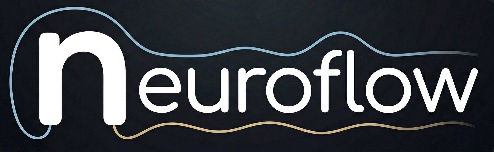

<div align="center">
  
  <h1>neuroflow</h1>
  <p><strong>A Claude Code plugin for agentic neuroscience research.</strong></p>
  <p>
    <a href="#whats-new">What's new</a> ·
    <a href="#why-neuroflow">Why</a> ·
    <a href="#commands">Commands</a> ·
    <a href="#skills">Skills</a> ·
    <a href="#agents">Agents</a> ·
    <a href="#hooks">Hooks</a> ·
    <a href="#project-memory">Project memory</a> ·
    <a href="#installation">Install</a> ·
    <a href="#contributing">Contribute</a>
  </p>
</div>

---

## What's new in 0.1.2

- 12 phase skills — [`neuroflow:phase-ideation`](skills/phase-ideation/SKILL.md) through [`neuroflow:phase-write-report`](skills/phase-write-report/SKILL.md) — each loaded automatically by its corresponding command to orient agent approach, relevant skills, and workflow hints

## What's new in 0.1.1

- Full research pipeline — 15 commands from [`/start`](commands/start.md) through [`/paper-review`](commands/paper-review.md), each writing to `.neuroflow/` project memory
- [`neuroflow:neuroflow-core`](skills/neuroflow-core/SKILL.md) — shared lifecycle and `.neuroflow/` folder spec that every command and agent follows; commands now automatically append significant decisions to `decisions.md`
- [`scholar`](agents/scholar.md), [`sentinel`](agents/sentinel.md), [`sentinel-dev`](agents/sentinel-dev.md) agents
- `sentinel` checks plugin version against `project_config.md` and flags when the plugin has been updated; both sentinels clear their report to "All clear" after fixing issues
- `project_config.md` now tracks `plugin_version` — kept in sync with `plugin.json` by `/start` and `/sentinel`
- MCP servers declared in `plugin.json`: PubMed, bioRxiv, Miro, Context7

---

## Why neuroflow

Most neuroscience software solves one problem at a time — a preprocessing library, a stats package, a reference manager. You still have to stitch everything together yourself, re-explain context at every step, and manually translate between tools and phases.

neuroflow is different. It is not a toolbox. It is a **Claude Code plugin** that brings agentic workflows into neuroscience research — from the first hypothesis all the way to a manuscript draft.

You work in your editor. Claude works alongside you — reading your data, writing analysis code, reviewing your paper, auditing your statistics — guided by skills and agents that understand neuroscience domain conventions.

**Focused on:**

- EEG, iEEG, fMRI, eye tracking, ECG, and other physiological signals
- Cognitive, clinical, and preclinical research
- Experimental paradigm development and real-time systems
- From hypothesis formulation to paper draft

---

## Commands

Run `/neuroflow:<command>` in any project folder. Start with `/neuroflow:start`.

### Entry point

| Command | What it does |
|---|---|
| [`/start`](commands/start.md) | Main entry point — if `.neuroflow/` exists, shows current phase and status; if not, interviews the user and creates the project memory structure |

### Research pipeline

| Command | What it does |
|---|---|
| [`/ideation`](commands/ideation.md) | Brainstorm a research question, explore literature via scholar, formalize an idea, or produce a project proposal |
| [`/grant-proposal`](commands/grant-proposal.md) | Write a grant application — specific aims, significance, innovation, approach, budget, timeline |
| [`/experiment`](commands/experiment.md) | Paradigm design (PsychoPy), recording setup, instrument and LSL configuration |
| [`/tool-build`](commands/tool-build.md) | Build a lab tool or software pipeline — real-time systems, acquisition, BCI, paradigm code |
| [`/tool-validate`](commands/tool-validate.md) | Create a testing pipeline to verify a tool or paradigm works correctly |
| [`/data`](commands/data.md) | Data intake — locate data, validate BIDS structure, run conversion scripts |
| [`/data-preprocess`](commands/data-preprocess.md) | Run a preprocessing pipeline — filtering, ICA, epoching, artifact rejection, QC |
| [`/data-analyze`](commands/data-analyze.md) | Run an analysis pipeline — ERPs, time-frequency, connectivity, decoding, GLM |
| [`/paper-write`](commands/paper-write.md) | Generate a manuscript draft from results and figures |
| [`/paper-review`](commands/paper-review.md) | Pre-submission peer review — logic, methods, statistics, writing, figures |
| [`/notes`](commands/notes.md) | Live note-taking — capture freeform input, then reformat into a clean structured document |
| [`/write-report`](commands/write-report.md) | Generate a structured report from `.neuroflow/` contents for any phase or the whole project |

### Utility

| Command | What it does |
|---|---|
| [`/phase`](commands/phase.md) | Show current phase and all phases worked on; optionally switch phase |
| [`/sentinel`](commands/sentinel.md) | Full audit of `.neuroflow/` — drift detection, broken references, preregistration vs progress |

---

## Skills

Skills are invoked by Claude automatically when relevant, or triggered explicitly.

| Skill | What it does |
|---|---|
| [`neuroflow:neuroflow-core`](skills/neuroflow-core/SKILL.md) | Core rules and lifecycle for all commands and agents — `.neuroflow/` folder spec, `flow.md` format, command lifecycle (including auto-write to `decisions.md`), frontmatter standard |
| [`neuroflow:review-neuro`](skills/review-neuro/SKILL.md) | Rigorous pre-submission peer review of a neuroscience manuscript |
| [`neuroflow:neuroflow-develop`](skills/neuroflow-develop/SKILL.md) | Guide for developing and maintaining the neuroflow plugin |
| [`neuroflow:skill-creator`](skills/skill-creator/SKILL.md) | Guide for creating new neuroflow skills |
| [`neuroflow:phase-ideation`](skills/phase-ideation/SKILL.md) | Phase guidance for /ideation — approach, relevant skills, workflow hints |
| [`neuroflow:phase-grant-proposal`](skills/phase-grant-proposal/SKILL.md) | Phase guidance for /grant-proposal |
| [`neuroflow:phase-experiment`](skills/phase-experiment/SKILL.md) | Phase guidance for /experiment |
| [`neuroflow:phase-tool-build`](skills/phase-tool-build/SKILL.md) | Phase guidance for /tool-build |
| [`neuroflow:phase-tool-validate`](skills/phase-tool-validate/SKILL.md) | Phase guidance for /tool-validate |
| [`neuroflow:phase-data`](skills/phase-data/SKILL.md) | Phase guidance for /data |
| [`neuroflow:phase-data-preprocess`](skills/phase-data-preprocess/SKILL.md) | Phase guidance for /data-preprocess |
| [`neuroflow:phase-data-analyze`](skills/phase-data-analyze/SKILL.md) | Phase guidance for /data-analyze |
| [`neuroflow:phase-paper-write`](skills/phase-paper-write/SKILL.md) | Phase guidance for /paper-write |
| [`neuroflow:phase-paper-review`](skills/phase-paper-review/SKILL.md) | Phase guidance for /paper-review — delegates review to neuroflow:review-neuro |
| [`neuroflow:phase-notes`](skills/phase-notes/SKILL.md) | Phase guidance for /notes |
| [`neuroflow:phase-write-report`](skills/phase-write-report/SKILL.md) | Phase guidance for /write-report |

---

## Agents

Agents are autonomous subprocesses launched by commands when deeper, focused work is needed.

| Agent | What it does |
|---|---|
| [`scholar`](agents/scholar.md) | Searches PubMed and bioRxiv simultaneously, returns a clean paper list with ⚠️ preprint and 🔒 paywall markers, supports follow-up synthesis and saving |
| [`sentinel`](agents/sentinel.md) | Project coherence guard — audits `.neuroflow/` for drift, broken references, preregistration deviations, and plugin version sync; clears report after fixes |
| [`sentinel-dev`](agents/sentinel-dev.md) | Plugin development coherence guard — checks folder names vs frontmatter, README tables, version sync, dead references, command frontmatter completeness |

---

## Hooks

Hooks fire automatically on tool use events.

| Hook | Trigger | What it does |
|---|---|---|
| ruff formatter | `PostToolUse` — Edit / Write | Auto-formats any `.py` file written during a session |
| session logger | `PostToolUse` — Write / Edit / Bash | Appends a timestamped entry to today's `.neuroflow/sessions/YYYY-MM-DD.md` (only fires if `.neuroflow/` exists in the working directory) |

> **Pre-session orientation** is handled via `.claude/CLAUDE.md` injection — `/start` writes a neuroflow block there so Claude always knows the active phase and where to find project context.

---

## Project memory

Every neuroflow command writes its output to `.neuroflow/` at the root of your project repo. This is the shared memory of your project — readable by every command and agent, across sessions.

```
.neuroflow/
├── project_config.md       ← current phase, research question, tools, plugin_version — read by every command
├── flow.md                 ← index of all subfolders
├── decisions.md            ← key decisions log (git-tracked)
├── sentinel.md             ← sentinel audit report
├── linked_flows.md         ← paths to other .neuroflow/ folders (optional)
├── team.md                 ← project members and roles (optional)
├── timeline.md             ← milestones and deadlines (optional)
├── sessions/               ← one .md per day — add to .gitignore
├── references/             ← papers, URLs, dataset paths + flow.md (optional, create when needed)
├── ethics/                 ← IRB documents, consent forms
├── preregistration/        ← OSF / AsPredicted documents
├── finance/                ← grant documents, expense tracking
├── ideation/               ← research questions, proposals, literature reviews
├── grant-proposal/         ← grant application drafts
├── experiment/             ← paradigm scripts, recording setup docs
├── tool-build/             ← tool specs and build notes
├── tool-validate/          ← validation plans and results
├── data/                   ← data inventory and intake reports
├── data-preprocess/        ← preprocessing configs and QC reports
├── data-analyze/           ← analysis plans and result summaries
├── paper-write/            ← manuscript drafts
├── paper-review/           ← review reports
├── notes/                  ← structured notes from meetings and talks
└── write-report/           ← project reports
```

---

## Installation

```bash
claude plugin marketplace add stanislavjiricek/neuroflow
claude plugin install neuroflow@neuroflow
```

Or from within Claude Code:

```
/plugin marketplace add stanislavjiricek/neuroflow
/plugin install neuroflow@neuroflow
```

For local development:

```bash
git clone https://github.com/stanislavjiricek/neuroflow
claude --plugin-dir ./neuroflow
```

Once installed, run `/neuroflow:start` in any project folder to get started.

---

## Contributing

neuroflow is intentionally small right now — and that's the point. It is designed to grow with the community.

If you work in neuroscience and have a workflow that Claude could help with, contributions are very welcome:

- **New skills** — domain knowledge for a modality, analysis method, or writing task
- **New commands** — multi-step pipelines for common research workflows
- **New agents** — autonomous subprocesses for focused tasks

See [`neuroflow:neuroflow-develop`](skills/neuroflow-develop/SKILL.md) for the development guide, or open an issue to discuss an idea before building.

---

## License

MIT © Stanislav Jiricek
