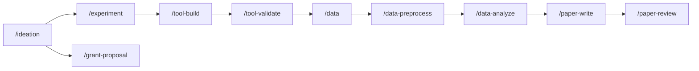

# Commands

Run commands with `/neuroflow:<command>` in any project folder. Always start with `/neuroflow:start`.

---

## The research pipeline

neuroflow models a complete neuroscience research lifecycle. Commands pass context to each other through `.neuroflow/` project memory, so each phase picks up where the last left off.

!!! tip
    You don't have to follow the pipeline in order. Jump to whichever phase you're in — neuroflow will read your project memory and orient itself.

---

## Entry points

| Command | What it does |
|---|---|
| [`/start`](start.md) | Main entry point — scans your project, sets up `.neuroflow/`, or shows current status |
| [`/setup`](setup.md) | Interactive wizard for PubMed and Miro credentials |

---

## Research pipeline

| Command | Phase | What it does |
|---|---|---|
| [`/ideation`](ideation.md) | ideation | Brainstorm, literature search, formalize a research question, write proposal |
| [`/grant-proposal`](grant-proposal.md) | grant-proposal | Full grant application — aims, significance, innovation, approach, budget |
| [`/experiment`](experiment.md) | experiment | PsychoPy paradigm, recording setup, LSL/marker configuration |
| [`/tool-build`](tool-build.md) | tool-build | Build lab tools — real-time systems, BCI, acquisition pipelines |
| [`/tool-validate`](tool-validate.md) | tool-validate | Testing pipeline for timing, markers, data output, edge cases |
| [`/data`](data.md) | data | Data inventory, BIDS validation, format conversion |
| [`/data-preprocess`](data-preprocess.md) | data-preprocess | Filtering, ICA, epoching, artifact rejection, QC |
| [`/data-analyze`](data-analyze.md) | data-analyze | ERPs, time-frequency, connectivity, decoding, GLM |
| [`/paper-write`](paper-write.md) | paper-write | Full manuscript draft from results and figures |
| [`/paper-review`](paper-review.md) | paper-review | Pre-submission peer review — logic, methods, stats, writing |
| [`/notes`](notes.md) | notes | Live note-taking — capture rough input, reformat into a clean document |
| [`/write-report`](write-report.md) | write-report | Generate a structured report from `.neuroflow/` for any phase or the whole project |

---

## Utility commands

| Command | What it does |
|---|---|
| [`/phase`](phase.md) | Show current phase and all phases worked on; optionally switch phase |
| [`/sentinel`](sentinel.md) | Full audit of `.neuroflow/` — drift detection, broken references, version sync |

---

## How commands work

Every command follows the same lifecycle:

1. **Read skills** — Claude loads the phase-specific skill (e.g. `neuroflow:phase-ideation`) for domain guidance
2. **Read project memory** — Claude reads `project_config.md` and `flow.md` to orient itself
3. **Do the work** — Claude interacts with you to complete the phase task
4. **Write outputs** — Results go into the phase subfolder inside `.neuroflow/`
5. **Update memory** — `flow.md` and `project_config.md` are updated; a session entry is appended

This means every command is context-aware — it knows your research question, your modality, your tools, and what's been done before.
